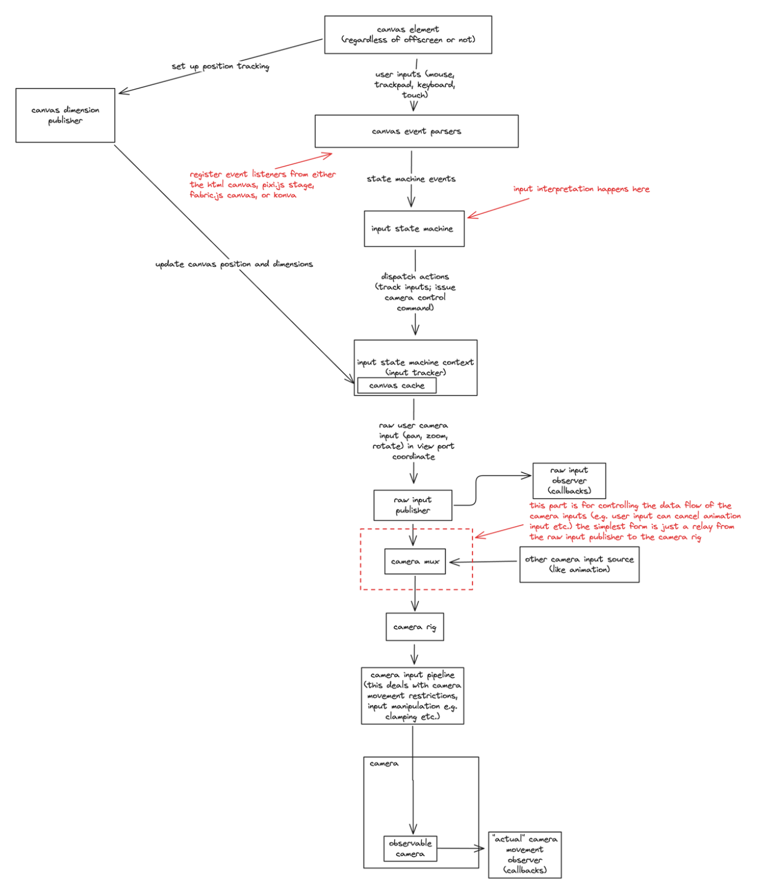

<h1 align="center">
    uē-tôo
</h1>
<p align="center">
    pan, zoom, rotate, and more with your html canvas.
</p>

<div align="center">

[](https://www.npmjs.com/package/ue-too)
[](https://github.com/niuee/board/actions/workflows/ci-test.yml)
[](https://github.com/niuee/board/blob/main/LICENSE.txt)
[](https://bundlephobia.com/package/ue-too)

</div>

<p align="center">
  <a href="#quick-demo">Quick Demo</a> •
  <a href="#installation-and-usage">Install</a> •
  <a href="#key-features">Key Features</a> •
  <a href="#quick-start-using-only-html-canvas">Quick Start</a> •
  <a href="#development">Development</a> •
  <a href="#under-the-hood">Basic API Overview</a>
</p>


<p align="center">
    This is is a small demo gif of what board is capable of.
</p>

> This library is still under development. Some of the APIs are not stable and will change.

## What this library is?
- Transforms your HTML canvas into a near-infinite canvas with panning, zooming, and rotation capabilities
- Provides utility functions that simplify the complex mathematics required for operating an infinite canvas
- Works with multiple canvas frameworks (vanilla, Pixi.js, Fabric.js, Konva) as the underlying mathematical principles remain consistent
- Serves as a foundation library for building your own infinite canvas applications
- Accomplishes the same goal as pixi-viewport but not dependent on pixi.js

## What this library is not?
- A complete drawing application like Excalidraw, tldraw, or similar tools
- A full-featured package with built-in drawing tools and user interfaces

## Why?

Picture this: 

You are building a web app that allows users to draw on a canvas. You have your pen and eraser tools ready to go.
You try it out and finds that you can't quite get the tiny details of the drawing just right, so you need a way to zoom in on the drawing.

After you have the zoom feature in place, you find that once you zoom in, you can't see other parts of the drawing. You need a way to pan around the canvas.
Once you have the pan feature, this is when the code starts to get a little messy. 
You might have your logic tied to the canvas element's event listeners. What if you need to support touch input? 

This is where `ue-too` comes in. It takes care of the panning and zooming part for you so you can focus on the other parts of the app.

Even if you're not building a drawing app, if you have a canvas that you need to pan around then give ue-too a try. (It works with pixi, fabric, konva, vanilla js canvas API, and even headless canvas in node.js)ge with built-in drawing tools and user interfaces

## Quick Demo
[Stackblitz example link](https://stackblitz.com/edit/vitejs-vite-jpxrtxzg?file=index.html): this is the exact same example as the one in the [Quick Start](#quick-start-using-only-html-canvas) section.

There are a few more examples in the [`devserver`](https://github.com/niuee/board/tree/main/devserver) directory. Including how to integrate with pixi.js, fabric.js, and konva. (incomplete but giving a rough and general direction on how to do it)

## Docs
- [API Documentation](https://ue-too.github.io/ue-too/)
- [中文文件連結](https://ue-too.github.io/ue-too/tw/index.html) (還在努力補沒翻完的，還要開發新功能，時間真的不太夠 u.u)

## Installation and Usage
### Package manager
install it using
```bash
npm install ue-too
```
and import it like
```javascript
import { Board } from "ue-too";
```

### Download From Github
Download the bundled JavaScript (board.js) in the [releases](https://github.com/niuee/board/releases/) page of the repository and put it in the your project directory for other JavaScript module to import like this.
```javascript
import { Board } from "./ue-too.js";
```

### Import From jsdelivr
```javascript
import { Board } from "https://cdn.jsdelivr.net/npm/ue-too@latest/index.mjs";
```
_iife is no longer supported_

## Key Features
- Modularity: you don't have to use everything from this library; take only what you need. (detail in the [under the hood](#under-the-hood) section)
- Supports a wide variety of input methods. (touch, trackpad(macOS), keyboard mouse) But you can still tweak how things work.
- Works with just HTML and JavaScript but also works with frontend frameworks/libraries with a little bit of extra work. (examples are on the way)
- You can use this with pixi.js, fabric.js, Konva, and just html canvas. (examples are on the way)

## Quick Start (Using only HTML canvas)

I am borrowing the example from the MDN documentation on the [__Canvas API__](https://developer.mozilla.org/en-US/docs/Web/API/Canvas_API) page.

You can go to [CodeSandbox](https://codesandbox.io), [Stackblitz](https://stackblitz.com/), or any other online IDE or code sandbox to follow along. (or just locally on your computer)

Following the MDN example, you would have a green rectangle in the canvas, and you should have the following html and javascript code.

HTML:
```html
<canvas id="canvas"></canvas>
```

JavaScript:
```javascript
const canvas = document.getElementById("canvas");
const ctx = canvas.getContext("2d");

ctx.fillStyle = "green";
ctx.fillRect(10, 10, 150, 100);
```

Now we're going to add `ue-too` to the canvas so you can zoom in on the green rectangle and pan around it.

First we need to import `ue-too` and create a new `Board` instance. Also we need to remove the constant `ctx` because canvas only allows one context to be created per canvas element.
But we can keep the `ctx.fillStyle = "green";` and `ctx.fillRect(10, 10, 150, 100);` as comment for reference later on how to add the rectangle back to the canvas.

```javascript
// import the Board Class
import { Board } from "ue-too";

const canvas = document.getElementById("canvas");

// remove the ctx constant

// instantiate the board by passing in the canvas element
const board = new Board(canvas);

// comment these out for now
// ctx.fillStyle = "green";
// ctx.fillRect(10, 10, 150, 100);
```

If you have dabbled with the canvas API before, you probably know that what's drawn on the canvas is there to stay, so in order to make it look like the rectangle is moving and being zoomed in, we need to clear the canvas and redraw the rectangle at the new position and scale. You can either redraw using `requestAnimationFrame` or when the user input is detected. The `Board` class is designed using the `requestAnimationFrame` method, so we need a `requestAnimationFrame` callback for the `Board` instance to call its `step` function.

```javascript
// import the Board Class
import { Board } from "ue-too";

const canvas = document.getElementById("canvas");

// remove the ctx constant

// instantiate the board by passing in the canvas element
const board = new Board(canvas);

// comment these out for now
// ctx.fillStyle = "green";
// ctx.fillRect(10, 10, 150, 100);

// add a callback to the requestAnimationFrame, and call the step function of the board instance.
function draw(timestamp) {
    // step the board 
    board.step(timestamp);
    
    // request the next frame
    requestAnimationFrame(draw);
}

// call the draw function every frame
requestAnimationFrame(draw);
```

After that we just need to add the rectangle back to the canvas.

```javascript
// import the Board Class
import { Board } from "ue-too";

const canvas = document.getElementById("canvas");

// remove the ctx constant

// instantiate the board by passing in the canvas element
const board = new Board(canvas);

// comment these out for now
// ctx.fillStyle = "green";
// ctx.fillRect(10, 10, 150, 100);


// add a callback to the requestAnimationFrame, and call the step function of the board instance.
function draw(timestamp) {
    // step the board 
    board.step(timestamp);

    // add the rectangle back to the canvas, the drawing steps is the same as the MDN example but we're using the context from the board instance.
    board.context.fillStyle = "green";
    board.context.fillRect(10, 10, 150, 100);
    
    // request the next frame
    requestAnimationFrame(draw);
}

// call the draw function every frame
requestAnimationFrame(draw);
```

Now you can pan and zoom around. 

The default pan inputs are:

- Mouse + Keyboard: drag the mouse while holding down the spacebar or drag using the scroll wheel button
- Trackpad: two finger swipe
- Touch: two finger swipe

The default zoom inputs are:

- Mouse + Keyboard: scroll wheel + ctrl
- Trackpad: two finger pinch
- Touch: two finger pinch

There you go, you've got a canvas with pan and zoom! (and also rotation but now there's no direct user input for that meaning you have to code it out) 

Anything you want to draw on the canvas should be in the `requestAnimationFrame` callback and after the `step` function of the `Board` instance is called.
The `Board` instance is designed as an overarching class that needs the least amount of setup. But that comes with the cost implementing other features within the framework of the `Board` class.
If you need more customization, you can look into the [under the hood](#under-the-hood-a-rather-brief-overview) section and don't use the `Board` class.

The `Board` class does these things so you don't have to:
- Handles and interprets the input events from the canvas element
- Automatically adjusts the camera zoom boundaries if the entire viewport of the camera should be bounded within a limit.
- a lot more... 

However, every components of the `Board` class and every util functions are also accessible to the user of the library so you can come up with your own board class, and you don't need to use the `requestAnimationFrame` callback method for the redrawing part as well.

## Development

> This is to directly work on the source code of the library. Useful if you want to contribute to the library or fork a version for your own use. If you just want to use the library and need customizations on the behavior of the components, you can skip this section. Go the [under the hood](#under-the-hood) section for more detail on how the library works for customization.
To start developing `board` first clone the repo.

Then install the dependencies using

```bash
pnpm i
```

I am using pnpm as the package manager for this project.
Node version 20.11.0 is used for development. (Some of the scripts that I wrote for ci/cd uses node version 20 APIs and is not compatible with 22 (specifically the `assert`) I will migrate them to use node version 22 APIs when I have time.)

The dev environment setup for this project is relatively simple. Let me break down the different aspects.
- Bundling (rollup): `pnpm build` Bundling is done through rollup. There's a `rollup.config.js` in charge of that. Every subdirectory in the `src` directory gets its own bundled index.js file.
- Unit Testing (jest): `pnpm test` There's not a lot of tests right now. Only the core functionalities revolving around the camera are unit tested. The next section I will move on to test is the input state machine.
- Dev Server (vite): `pnpm dev` The `devserver` directory contains the current examples of the board. It's sort of like a playground. The more complete example is the in the `main.ts` file.
- Docs Dev Server (vite): `pnpm dev:docs` would spin up a docs server serving files from the directory `docs-staging`
- Documentation (typedoc): `pnpm doc:default` would generate a `docs-staging/en` and then `pnpm doc:move2prod` would copy the entire `docs-staging` to `docs`
- Translation: __Pending__ This is a work in progress probably not going to be ready for the version 0.2 release. The flow of how things should be done is still in discussion.

And then off you go! You can modify however as you like it.

The [API documentation](https://ue-too.github.io/ue-too/) has all the APIs listed.

## Under the Hood

ue-too consists of 3 core components: 

- `Board Camera (viewport)`: This is the core of the cores xD; It's the class that holds the information about the viewport and how to control the camera's position, rotation, and zoom level.
- `Camera Input Multiplexer`: This is the part that determines which kind of input should be passed through based on the current condition. This is to support multiple input methods. For example, user input would take precedence over the transition animation input and so on. 
- `User Input Interpretation`: This is the part that handles the user input events from the canvas element (pointer, keyboard, touch, etc.), and based on the events determine what the user intentions are.

To see detail of each component navigate to the respective readme in the subdirectories.
- [Board Camera](./src/board-camera/README.md)
- [Camera Mux](./src/camera-mux/README.md)
- [User Input Interpreter](./src/input-interpretation/README.md)

It's recommended to start with the [Board Camera](./src/board-camera/README.md) since the other parts are built on top of it.

Below is a diagram showing from the user input to how the camera is updated and everything in the middle. 



## TODO
- [x] Add a canvas position dimension publisher that can be used to get the position and dimension of the canvas.
- [ ] Add a `boardify-pixi` package that contains utility functions for the board to work with pixi.js.
- [ ] Add a `boardify-fabric` package that contains utility functions for the board to work with fabric.js.
- [ ] Add a `boardify-konva` package that contains utility functions for the board to work with konva.js.
- [ ] Add an example of the board being used with react.
- [ ] Add an example of the board being used with svelte. (I'm learning svelte right now so I can make a example for that)
- [ ] Add an example of the board being used with vue. (Currently I don't have any plans on learning vue so probably not going to make one very soon)
- [ ] A documentation site. There is a lot of util stuff that I don't think will fit in here in the readme. So stay tuned! (I am experimenting with docusaurus right now so it might be a docusaurus site)

