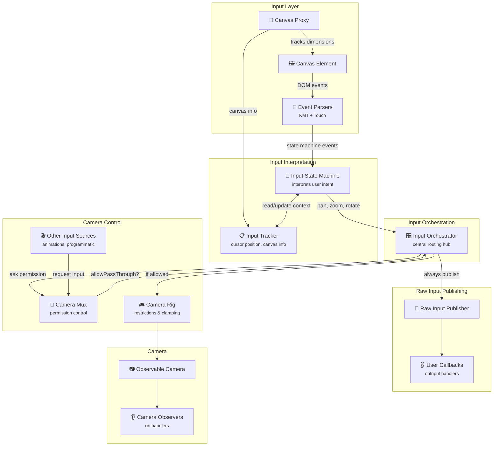

<h1 align="center">
    uē-tôo
</h1>
<p align="center">
    pan, zoom, rotate, and more with your html canvas.
</p>

<div align="center">

[](https://www.npmjs.com/package/@ue-too/board)
[](https://github.com/ue-too/ue-too/actions/workflows/ci-test.yml)
[](https://github.com/ue-too/ue-too/blob/main/LICENSE.txt)
[](https://bundlephobia.com/package/@ue-too/board)

</div>

<p align="center">
  <a href="#examples">Examples</a> •
  <a href="#quick-coding-demo">Quick Coding Demo</a> •
  <a href="https://ue-too.github.io/documentation/board/">Documentation</a> •
  <a href="#installation-and-usage">Install</a> •
  <a href="#key-features">Key Features</a> •
  <a href="#quick-start-html-canvas">Quick Start</a> •
  <a href="#development">Development</a> •
  <a href="#under-the-hood">Basic API Overview</a>
</p>


<p align="center">
    A demonstration of uē-tôo's core functionality.
</p>

> Note: This library is under active development. Some APIs may change in future releases.

## Overview

### What This Library Provides

- Transforms HTML canvas into a near-infinite canvas with panning, zooming, and rotation capabilities
- Provides utility functions that simplify the complex mathematics required for infinite canvas operations
- Compatible with multiple canvas frameworks (vanilla, Pixi.js, Fabric.js, Konva) as the underlying mathematical principles remain consistent
- Serves as a foundation library for building your own infinite canvas applications
- Accomplishes the same goal as pixi-viewport but without pixi.js dependency

### What This Library Is Not

- A complete drawing application like Excalidraw or tldraw
- A full-featured package with built-in drawing tools and user interfaces

## Examples

A live website containing the examples is available [here](https://ue-too.github.io/ue-too/).

This monorepo includes comprehensive examples demonstrating various packages and integrations:

### Core Examples

- [**Base Example**](https://ue-too.github.io/ue-too/base/) - Basic canvas viewport with pan, zoom, and rotate
- [**Attach / Detach Example**](https://ue-too.github.io/ue-too/attach-detach/) - Dynamically attach and detach a canvas from the board
- [**Navigation Example**](https://ue-too.github.io/ue-too/navigation/) - Keyboard-driven camera panning via `panByViewPort()`
- [**Ruler Example**](https://ue-too.github.io/ue-too/ruler/) - Measurement ruler overlay that updates with pan and zoom
- [**Camera Animation**](https://ue-too.github.io/ue-too/camera-animation/) - Smooth animated camera transitions on click
- [**Image Example**](https://ue-too.github.io/ue-too/image-example/) - Upload and display an image on the pannable canvas
- [**SVG Example**](https://ue-too.github.io/ue-too/svg/) - Board camera system applied to SVG elements

### Framework Integrations

- [**PixiJS Integration**](https://ue-too.github.io/ue-too/pixi-integration/) - Full-screen PixiJS canvas with board camera controls
- [**Konva Integration**](https://ue-too.github.io/ue-too/konva-integration/) - Konva.js stage synchronized with board camera transforms
- [**Fabric Integration**](https://ue-too.github.io/ue-too/fabric-integration/) - Fabric.js with toggleable movement/selection modes


## Documentation

The documentation is available [here](https://ue-too.github.io/documentation/board/).

## Installation and Usage

### Installation

```bash
npm install @ue-too/board
```

```javascript
import { Board } from '@ue-too/board';
```

## Key Features

- Modularity: Use only the components you need (details in the [Under the Hood](#under-the-hood) section)
- Comprehensive input support: touch, trackpad (macOS), keyboard, and mouse, with customizable behavior
- Framework-agnostic: Works with HTML and JavaScript, and can be integrated with frontend frameworks/libraries
- Multi-framework compatibility: Works with pixi.js, fabric.js, Konva, and vanilla HTML canvas

## Quick Start (HTML Canvas)

This example is based on the MDN documentation for the [Canvas API](https://developer.mozilla.org/en-US/docs/Web/API/Canvas_API). (turning the MDN example into an infinite canvas)

HTML:

```html
<canvas id="graph"></canvas>
```

```javascript
import { Board } from '@ue-too/board';

const canvas = document.getElementById('graph');

const board = new Board(canvas);

function draw(timestamp) {
    // step the board
    board.step(timestamp);

    // add the rectangle back to the canvas, the drawing steps is the same as the MDN example but we're using the context from the board instance.
    board.context.fillStyle = 'green';
    board.context.fillRect(10, 10, 150, 100);

    // request the next frame
    requestAnimationFrame(draw);
}

// call the draw function every frame
requestAnimationFrame(draw);
```
### Stackblitz Example to try out the library

[Stackblitz example link](https://stackblitz.com/edit/vitejs-vite-jpxrtxzg?file=index.html): This example demonstrates the basic functionality shown in the [Quick Start (HTML Canvas)](#quick-start-html-canvas) section.

### Default Input Controls

Pan:

- Mouse + Keyboard: Drag while holding spacebar or use scroll wheel button
- Trackpad: Two-finger swipe
- Touch: Two-finger swipe

Zoom:

- Mouse + Keyboard: Ctrl + scroll wheel
- Trackpad: Two-finger pinch
- Touch: Two-finger pinch

### A Few Things to Note

- All drawing operations should be performed in the `requestAnimationFrame` callback after the `step` function of the `Board` class instance is called, the `step` function clears the canvas.
- The `Board` class is designed for minimal setup but offers less flexibility
- For more customization, refer to the [Under the Hood](#under-the-hood) section

The `Board` class handles:

- Input event interpretation
- Automatic camera zoom boundary adjustments
- And more...

All components and utility functions are accessible, allowing you to create your own board implementation without using the `requestAnimationFrame` callback method.

For detailed camera control information, refer to the [Board Camera](https://github.com/ue-too/ue-too/tree/main/packages/board/src/camera) section.

## Development

> This section is for working directly with the library's source code. If you're using the library and need to customize component behavior, skip to the [Under the Hood](#under-the-hood) section.

> Currently not ready for contribution. If you have any suggestions or ideas, please let me know by creating an issue.

Please refer to the [README](https://github.com/ue-too/ue-too/) in the root directory for the overall development setup.

1. This package is within a monorepo, and is managed by nx and bun. I am not super familiar with nx or monorepo; this is kind of an experiment and a learning experience for me as well. (if you have any suggestions on how to improve the setup, please let me know!)
2. Bundling the package is done through rollup and testing through bun test.

## Under the Hood

ue-too consists of 3 core components:

- `Board Camera (viewport)`: This is the core of the cores xD; It's the class that holds the information about the viewport.
- `Camera Input Multiplexer`: This is the part that determines which kind of input should be passed through based on the current condition. This is to support multiple input methods. For example, user input would take precedence over the transition animation input and so on.
- `User Input Interpretation`: This is the part that handles the user input events from the canvas element (pointer, keyboard, touch, etc.), and based on the events determine what the user intentions are.

To see detail of each component navigate to the respective readme in the subdirectories.

- [Board Camera](https://github.com/ue-too/ue-too/tree/main/packages/board/src/camera)
- [Camera Mux](https://github.com/ue-too/ue-too/tree/main/packages/board/src/camera/camera-mux)
- [User Input Interpreter](https://github.com/ue-too/ue-too/tree/main/packages/board/src/input-interpretation)

It's recommended to start with the [Board Camera](https://github.com/ue-too/ue-too/tree/main/packages/board/src/camera) since the other parts are built on top of it.

Below is a diagram showing the data flow from user input to camera updates.


```mermaid
flowchart TB
    subgraph Input ["Input Layer"]
        CE["🖼️ Canvas Element"]
        CDP["📐 Canvas Proxy"]
        CEP["🎯 Event Parsers<br/><small>KMT + Touch</small>"]
    end

    subgraph Interpretation ["Input Interpretation"]
        ISM["🔄 Input State Machine<br/><small>interprets user intent</small>"]
        IT["📋 Input Tracker<br/><small>cursor position, canvas info</small>"]
    end

    subgraph Orchestration ["Input Orchestration"]
        IO["🎛️ Input Orchestrator<br/><small>central routing hub</small>"]
    end

    subgraph Publishing ["Raw Input Publishing"]
        RIP["📡 Raw Input Publisher"]
        RIO["👂 User Callbacks<br/><small>onInput handlers</small>"]
    end

    subgraph CameraControl ["Camera Control"]
        CM["🚦 Camera Mux<br/><small>permission control</small>"]
        OCIS["🎬 Other Input Sources<br/><small>animations, programmatic</small>"]
        CR["🎮 Camera Rig<br/><small>restrictions & clamping</small>"]
    end

    subgraph Camera ["Camera"]
        OC["📷 Observable Camera"]
        ACMO["👂 Camera Observers<br/><small>on handlers</small>"]
    end

    %% Canvas setup
    CDP -.->|"tracks dimensions"| CE
    CE -->|"DOM events"| CEP
    CDP -->|"canvas info"| IT

    %% Input interpretation
    CEP -->|"state machine events"| ISM
    ISM <-->|"read/update context"| IT
    ISM -->|"pan, zoom, rotate"| IO

    %% Orchestrator routing (parallel paths)
    IO -->|"always publish"| RIP
    RIP --> RIO
    IO -->|"ask permission"| CM

    %% Camera Mux
    OCIS -->|"request input"| CM
    CM -->|"allowPassThrough?"| IO

    %% Camera execution
    IO -->|"if allowed"| CR
    CR --> OC
    OC --> ACMO
```

**Key concepts:**

- **Event Parsers**: Register listeners on canvas (should work with vanilla out of the box, pixi.js, fabric.js, konva with some modifications)
- **Input State Machine**: Interprets raw events into camera intents (pan/zoom/rotate)
- **Input Orchestrator**: Routes outputs in parallel — always publishes raw input, and asks CameraMux for permission to pass through the input to the camera rig.
- **Camera Mux**: Controls input priority (e.g., user input can cancel animations). Returns `{allowPassThrough: true/false}`
- **Camera Rig**: Applies movement restrictions and clamping before updating camera
- **Observable Camera**: Final camera state with change observers
