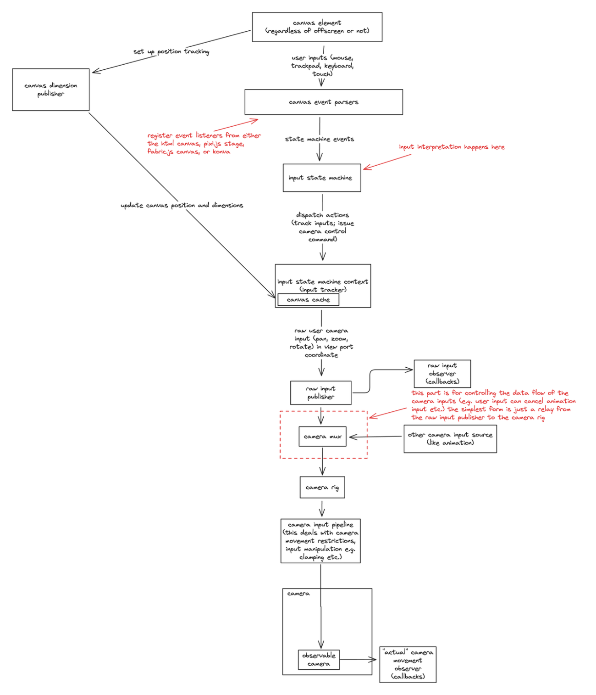

<h1 align="center">
    uē-tôo
</h1>
<p align="center">
    pan, zoom, rotate, and more with your html canvas.
</p>

<div align="center">

[](https://www.npmjs.com/package/@ue-too/board)
[](https://github.com/ue-too/ue-too/actions/workflows/ci-test.yml)
[](https://github.com/ue-too/ue-too/blob/main/LICENSE.txt)
[](https://bundlephobia.com/package/@ue-too/board)

</div>

<p align="center">
  <a href="#quick-demo">Quick Demo</a> •
  <a href="#installation-and-usage">Install</a> •
  <a href="#key-features">Key Features</a> •
  <a href="#quick-start-html-canvas">Quick Start</a> •
  <a href="#development">Development</a> •
  <a href="#under-the-hood">Basic API Overview</a>
</p>


<p align="center">
    A demonstration of uē-tôo's core functionality.
</p>

> Note: This library is under active development. Some APIs may change in future releases.

## Overview

### What This Library Provides
- Transforms HTML canvas into a near-infinite canvas with panning, zooming, and rotation capabilities
- Provides utility functions that simplify the complex mathematics required for infinite canvas operations
- Compatible with multiple canvas frameworks (vanilla, Pixi.js, Fabric.js, Konva) as the underlying mathematical principles remain consistent
- Serves as a foundation library for building your own infinite canvas applications
- Accomplishes the same goal as pixi-viewport but without pixi.js dependency

### What This Library Is Not
- A complete drawing application like Excalidraw or tldraw
- A full-featured package with built-in drawing tools and user interfaces

## Motivation

Consider this scenario:

You're building a web application that allows users to draw on a canvas. You have your pen and eraser tools ready. During testing, you notice that users need to zoom in to work on fine details. After implementing zoom functionality, you realize users can't see other parts of the drawing when zoomed in, necessitating a pan feature.

As you add these features, the code becomes increasingly complex, especially when handling different input methods (mouse, touch, trackpad). This is where `ue-too` comes in - it handles all the panning and zooming logic, allowing you to focus on your application's core functionality.

Even if you're not building a drawing app, `ue-too` is useful for any canvas that requires panning functionality. It works with various frameworks including pixi.js, fabric.js, Konva, vanilla JavaScript canvas API, and even headless canvas in Node.js.

## Quick Demo
[Stackblitz example link](https://stackblitz.com/edit/vitejs-vite-jpxrtxzg?file=index.html): This example demonstrates the basic functionality shown in the [Quick Start](#quick-start-using-only-html-canvas) section.

Additional examples in the [`devserver`](https://github.com/niuee/board/tree/main/devserver) directory show integration with pixi.js, fabric.js, and Konva (incomplete but providing general implementation guidance).

## Documentation
- [API Documentation](https://ue-too.github.io/ue-too/) (Deprecated)
- [中文文件連結](https://ue-too.github.io/ue-too/tw/index.html) (還在努力補沒翻完的，還要開發新功能，時間真的不太夠 u.u) (Deprecated)

## Installation and Usage

### Package Manager
```bash
npm install @ue-too/board
```

```javascript
import { Board } from "@ue-too/board";
```

### Import from jsdelivr
```javascript
import { Board } from "https://cdn.jsdelivr.net/npm/@ue-too/board@latest/index.js";
```

> Note: IIFE format is no longer supported.

## Key Features
- Modularity: Use only the components you need (details in the [Under the Hood](#under-the-hood) section)
- Comprehensive input support: touch, trackpad (macOS), keyboard, and mouse, with customizable behavior
- Framework-agnostic: Works with HTML and JavaScript, and can be integrated with frontend frameworks/libraries
- Multi-framework compatibility: Works with pixi.js, fabric.js, Konva, and vanilla HTML canvas

## Quick Start (HTML Canvas)

This example is based on the MDN documentation for the [Canvas API](https://developer.mozilla.org/en-US/docs/Web/API/Canvas_API). (turning the MDN example into an infinite canvas)

HTML:
```html
<canvas id="graph"></canvas>
```

```javascript
import { Board } from "@ue-too/board";

const canvas = document.getElementById("graph");

const board = new Board(canvas);

function draw(timestamp) {
    // step the board 
    board.step(timestamp);

    // add the rectangle back to the canvas, the drawing steps is the same as the MDN example but we're using the context from the board instance.
    board.context.fillStyle = "green";
    board.context.fillRect(10, 10, 150, 100);
    
    // request the next frame
    requestAnimationFrame(draw);
}

// call the draw function every frame
requestAnimationFrame(draw);
```

### Default Input Controls

Pan:
- Mouse + Keyboard: Drag while holding spacebar or use scroll wheel button
- Trackpad: Two-finger swipe
- Touch: Two-finger swipe

Zoom:
- Mouse + Keyboard: Ctrl + scroll wheel
- Trackpad: Two-finger pinch
- Touch: Two-finger pinch

### Important Notes
- All drawing operations should be performed in the `requestAnimationFrame` callback after the `step` function
- The `Board` class is designed for minimal setup but offers less flexibility
- For more customization, refer to the [Under the Hood](#under-the-hood) section

The `Board` class handles:
- Input event interpretation
- Automatic camera zoom boundary adjustments
- And more...

All components and utility functions are accessible, allowing you to create your own board implementation without using the `requestAnimationFrame` callback method.

For detailed camera control information, refer to the [Board Camera](./src/board-camera/README.md) section.

## Development

> This section is for working directly with the library's source code. If you're using the library and need to customize component behavior, skip to the [Under the Hood](#under-the-hood) section.

> Currently not ready for contribution. If you have any suggestions or ideas, please let me know by creating an issue.

Please refer to the [README](./README.md) in the root directory for the overall development setup.

1. This package is within a monorepo, and is managed by nx and pnpm. I am not super familiar with nx or monorepo; this is kind of an experiment and a learning experience for me. (if you have any suggestions on how to improve the setup, please let me know!)
2. Bundling the package is done through rollup and testing through jest.


## Under the Hood

ue-too consists of 3 core components: 

- `Board Camera (viewport)`: This is the core of the cores xD; It's the class that holds the information about the viewport.
- `Camera Input Multiplexer`: This is the part that determines which kind of input should be passed through based on the current condition. This is to support multiple input methods. For example, user input would take precedence over the transition animation input and so on. 
- `User Input Interpretation`: This is the part that handles the user input events from the canvas element (pointer, keyboard, touch, etc.), and based on the events determine what the user intentions are.

To see detail of each component navigate to the respective readme in the subdirectories.
- [Board Camera](./src/camera/README.md)
- [Camera Mux](./src/camera/camera-mux/README.md)
- [User Input Interpreter](./src/input-interpretation/README.md)

It's recommended to start with the [Board Camera](./src/board-camera/README.md) since the other parts are built on top of it.

Below is a diagram showing from the user input to how the camera is updated and everything in the middle. 



## TODO
- [x] Add a canvas position dimension publisher that can be used to get the position and dimension of the canvas.
- [ ] Add a `boardify-pixi` package that contains utility functions for the board to work with pixi.js.
- [ ] Add a `boardify-fabric` package that contains utility functions for the board to work with fabric.js.
- [ ] Add a `boardify-konva` package that contains utility functions for the board to work with konva.js.
- [ ] Add an example of the board being used with react.
- [ ] Add an example of the board being used with svelte. (I'm learning svelte right now so I can make a example for that)
- [ ] Add an example of the board being used with vue. (Currently I don't have any plans on learning vue so probably not going to make one very soon)
- [ ] A documentation site. There is a lot of util stuff that I don't think will fit in here in the readme. So stay tuned! (I am experimenting with docusaurus right now so it might be a docusaurus site)

