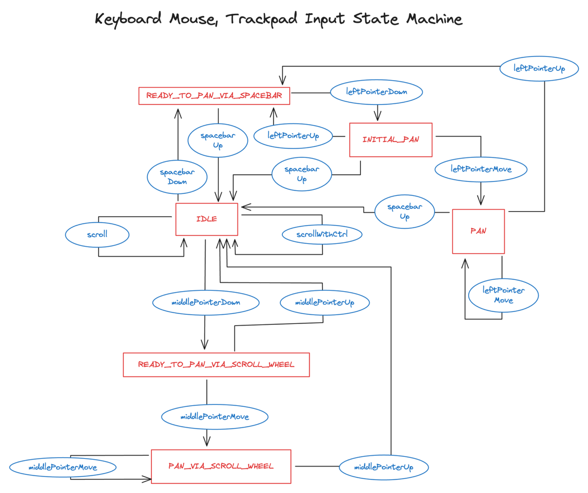

# User Input Interpretation

This module demonstrates how to interpret user input using the state machine pattern.

You can implement your own input interpretation logic. After processing the input, you can either:
1. Set the camera state directly using the `setPosition`, `setZoomLevel`, and `setRotation` methods
2. Use the camera rig as described in the [board camera README](../camera/README.md)

The module consists of two main components:
1. Input event handler layer
2. Input state machine

### Input Event Handler Layer
This layer registers event handlers for different input events. Since event systems vary across rendering options (e.g., vanilla canvas API differs from pixi.js's event system), this layer handles the differences in event payloads and event names.

### Input State Machine

The state machine manages different input states and transitions. Below are the state diagrams for different input types:

#### Keyboard, Mouse, and Trackpad Input

#### Touch Input

You can customize the state machine's behavior by defining relationships between states. The `@ue-too/being` library is used to implement the state machine. Please refer to the [being README](../../..//being/README.md) for more details.
